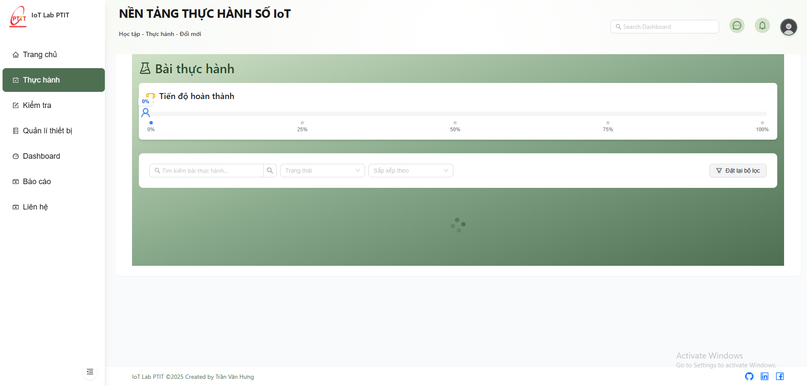
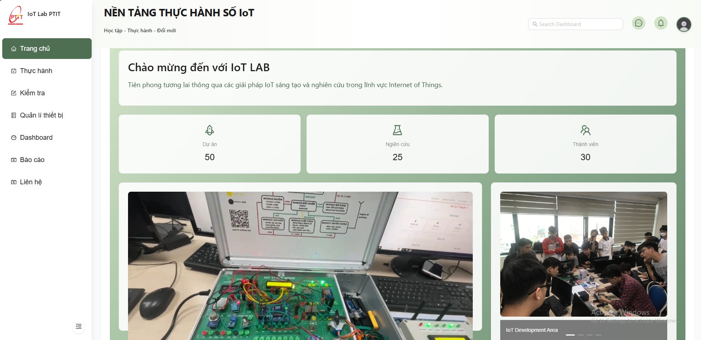

# 🌟 IoTLab WebApp - Nền tảng Học tập và Thực hành IoT

<div align="center">
  
  
  [](https://reactjs.org/)
  [](https://www.typescriptlang.org/)
  [](https://vitejs.dev/)
  [](https://tailwindcss.com/)
</div>

## 📝 Mô tả dự án

IoTLab WebApp là một nền tảng học tập và thực hành IoT toàn diện, được thiết kế đặc biệt cho môi trường phòng thí nghiệm. Ứng dụng cung cấp một hệ sinh thái học tập tích hợp, kết hợp giữa lý thuyết và thực hành, cho phép người dùng học tập, thực hành và tương tác với các thiết bị IoT trong môi trường thực tế.

### 🎯 Tính năng chính

#### 📚 Học tập và Tài liệu
- 📖 Thư viện tài liệu học tập phong phú
- 🎥 Video bài giảng và hướng dẫn thực hành
- 📝 Bài tập và dự án thực hành
- 📊 Tài liệu kỹ thuật và datasheet

#### 🔬 Môi trường Thực hành
- 🔌 Kết nối trực tiếp với các thiết bị IoT
- 📡 Tương tác với MQTT Broker
- 🎮 Điều khiển thiết bị thời gian thực
- 📊 Giám sát dữ liệu sensor
- 🔄 Mô phỏng các kịch bản IoT

#### 👥 Quản lý và Tương tác
- 👤 Quản lý người dùng và phân quyền
- 📱 Giao diện responsive cho mọi thiết bị
- 🔔 Thông báo thời gian thực
- 📈 Theo dõi tiến độ học tập

## 🖼️ Demo

### 📸 Hình ảnh

<div align="center">
  
  <p><em>Các bài thực hành phong phú, đa dạng</em></p>
  
  
  <p><em>Môi trường thực hành IoT</em></p>
  
  
  <p><em>Điều khiển thiết bị IoT</em></p>
</div>

### 🎥 Video Demo

[](https://www.youtube.com/watch?v=YOUR_VIDEO_ID)

## 🚀 Cài đặt và Chạy

### 🔧 Yêu cầu hệ thống

- Node.js (v18.0.0 trở lên)
- npm hoặc yarn
- Docker (tùy chọn)
- MQTT Broker (cho môi trường thực hành)

### 💻 Chạy trên môi trường local

1. Clone repository:
```bash
git clone https://github.com/tranhung26092002/IoTLab-WebApp-PTIT-BE
cd IoTLab-WebApp-PTIT-FE
```

2. Cài đặt dependencies:
```bash
npm install
# hoặc
yarn install
```

3. Cấu hình môi trường:
```bash
cp .env.example .env
# Chỉnh sửa các biến môi trường trong file .env
```

4. Chạy ứng dụng ở môi trường development:
```bash
npm run dev
# hoặc
yarn dev
```

5. Mở trình duyệt và truy cập:
```
http://localhost:3000
```

### 🐳 Triển khai với Docker

#### Cấu hình Docker

1. **Dockerfile**
```dockerfile
# Build stage
FROM node:20-alpine AS builder
WORKDIR /app
COPY package.json package-lock.json ./
RUN npm ci
COPY . .
RUN npm run build

# Production stage
FROM nginx:alpine
COPY --from=builder /app/dist /usr/share/nginx/html
COPY nginx.conf /etc/nginx/conf.d/default.conf
EXPOSE 80
CMD ["nginx", "-g", "daemon off;"]
```

2. **docker-compose.yml**
```yaml
services:
  react-app:
    build: 
      context: .
      dockerfile: Dockerfile
    container_name: react-app
    image: ${DOCKER_USERNAME}/react-app:latest  
    ports:
      - "80:80"
    networks:
      - app-network
    restart: always

networks:
  app-network:
    external: true
```

3. **deploy.sh**
```bash
#!/bin/bash
# Script tự động hóa quá trình triển khai
# - Đăng nhập DockerHub
# - Build và push image
# - Pull image mới và restart hệ thống
```

#### Các bước triển khai

1. **Chuẩn bị môi trường**
   - Tạo file `.env` với nội dung:
   ```env
   DOCKER_USERNAME=
   ```
   - Đảm bảo đã cài đặt Docker và Docker Compose
   - Tạo network Docker:
   ```bash
   docker network create app-network
   ```

2. **Build và chạy với Docker Compose**
   ```bash
   # Build và chạy container
   docker-compose up -d
   
   # Xem logs
   docker-compose logs -f
   
   # Dừng và xóa container
   docker-compose down
   ```

3. **Triển khai tự động với deploy.sh**
   ```bash
   # Cấp quyền thực thi
   chmod +x deploy.sh
   
   # Chạy script triển khai
   ./deploy.sh
   ```

4. **Kiểm tra triển khai**
   - Truy cập ứng dụng tại: `http://localhost:80`
   - Kiểm tra logs:
   ```bash
   docker logs react-app
   ```

#### Các lệnh Docker hữu ích

```bash
# Xem danh sách container
docker ps

# Xem logs container
docker logs react-app

# Rebuild image
docker-compose build

# Restart container
docker-compose restart

# Xóa tất cả container và image
docker-compose down --rmi all
```

#### Xử lý sự cố

1. **Container không khởi động**
   ```bash
   # Kiểm tra logs
   docker logs react-app
   
   # Kiểm tra cấu hình nginx
   docker exec react-app nginx -t
   ```

2. **Lỗi network**
   ```bash
   # Kiểm tra network
   docker network ls
   docker network inspect app-network
   
   # Tạo lại network nếu cần
   docker network create app-network
   ```

3. **Lỗi permission**
   ```bash
   # Cấp quyền cho script
   chmod +x deploy.sh
   
   # Kiểm tra quyền thư mục
   ls -la
   ```

## 📁 Cấu trúc thư mục

```
IoTLab-WebApp-PTIT-FE/
├── public/                 # Static files
│   └── logo.png           # Logo của ứng dụng
├── docs/                  # Tài liệu
│   ├── images/           # Hình ảnh demo
│   │   ├── dashboard.png
│   │   ├── lab-environment.png
│   │   └── device-control.png
│   ├── videos/           # Video demo
│   │   └── demo.mp4
│   ├── api.md            # Tài liệu API
│   ├── components.md     # Tài liệu components
│   └── deployment.md     # Hướng dẫn triển khai
├── src/                  # Source code
└── README.md            # Tài liệu dự án
```

## 🛠️ Công nghệ sử dụng

- **Frontend Framework:** React 18.3
- **Language:** TypeScript
- **Build Tool:** Vite
- **Styling:** TailwindCSS
- **UI Components:** Ant Design, Material-UI
- **State Management:** Zustand
- **Data Fetching:** React Query
- **Charts:** Recharts, Ant Design Charts
- **Real-time Communication:** WebSocket (STOMP), MQTT
- **PDF Handling:** React-PDF
- **Form Handling:** React Hook Form

## 📚 Tài liệu

- [API Documentation](docs/api.md)
- [Component Documentation](docs/components.md)
- [Deployment Guide](docs/deployment.md)
- [MQTT Integration Guide](docs/mqtt-integration.md)
- [Lab Setup Guide](docs/lab-setup.md)

---

<div align="center">
  Made with ❤️ by Hung Tran
</div>
